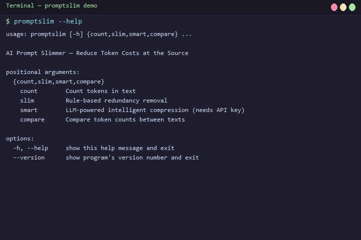
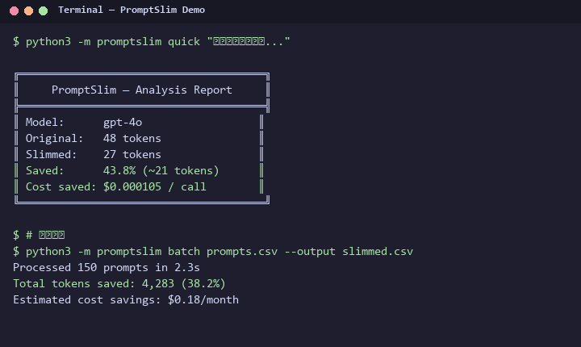

# PromptSlim 🪒

**AI Prompt Slimming Toolkit — reduce token consumption at the source before every API call.**

[🌐 English](README.md) | [中文](README_zh.md)

[](https://pypi.org/project/promptslim/)
[](https://pypi.org/project/promptslim/)
[](https://github.com/JING04-PRODUCER/promptslim/actions/workflows/python-test.yml)
[](LICENSE)
[](https://pypi.org/project/promptslim/)

> 🎯 **Token Optimization · Cost Saving · Prompt Engineering · LLM Tools**

> 📖 **掘金详解 v0.3.0：** [给你的 AI 提示词剃得再干净一点](https://juejin.cn/post/7652277909156790272)

## What Problem Does This Solve?

Every word you send to an LLM costs money. Filler words, redundant phrases, and polite fluff silently drain your budget. Most developers don't realize 5-40% of their token spend is waste.

**PromptSlim** strips redundancy at the prompt level — before it reaches the API. Two lines of Python and you're done.

## Quick Start

```bash
pip install promptslim
```

### Python SDK

```python
from promptslim import quick_slim

text = "嗯，那个我想说的是，这个功能非常非常好用，对吧？"
report = quick_slim(text)
print(f"Token saved: {report.savings_pct}% | Cost saved: ${report.cost_saved:.6f}/call")
```

### One-Line OpenAI Integration

```python
import promptslim
promptslim.patch_openai()  # 一行代码，自动压缩所有 prompt

from openai import OpenAI
client = OpenAI()
# 所有调用自动压缩 — 无需改动业务代码
response = client.chat.completions.create(model="gpt-4o", messages=[...])
```

### CLI

```bash
# Count tokens
promptslim count "Hello world" -m gpt-4o

# Quick slim (rule-based, no API required)
promptslim slim prompt.txt -o slimmed.txt

# Smart compression (LLM-powered, preserves semantics)
promptslim smart long_chat.json -m gpt-4o-mini --max-tokens 512 -o slimmed.txt

# Compare two texts
promptslim compare old.txt new.txt
```

## Demo



## 快速体验

```bash
pip install promptslim
echo "嗯那个我想说的是这个功能非常非常好用对吧" | promptslim slim
```



### Python API

```python
from promptslim import quick_slim
report = quick_slim("嗯那个我想说的是这个功能非常非常好用对吧")
print(f"节省 {report.savings_pct}% Token")
```

### 更多用法

```bash
# 统计 Token 数
promptslim count -i prompt.txt

# 智能压缩（LLM 二次精简）
promptslim smart -i prompt.txt --api-key YOUR_KEY

# 对比精简前后差异
promptslim compare -i prompt.txt
```

| 功能 | 说明 |
|------|------|
| 中英文冗余 | 40+ 条规则自动检测 |
| 代码保护 | Python/JS/Go 代码块自动跳过 |
| LLM 语义压缩 | 调用 LLM 二次精简，再省 30-50% |
| 缓存分析 | Anthropic Prompt Caching 命中率预估 |

```
Original: In order to basically say that this is really very important
          and actually I think we should definitely consider it.
Slimmed:  say this is important and I think we should consider it.
Saved:    31.3% tokens

Original: 嗯，那个我想说的是，这个功能非常非常非常好用，对吧？你知道吗？
Slimmed:  我想说的是，这个功能好用。
Saved:    40.0% tokens
```

## Real-world Benchmarks

| Scenario | Original Tokens | Slimmed | Savings | Semantics |
|----------|----------------|---------|---------|-----------|
| Customer support logs | 15,432 | 9,871 | 36.0% | Preserved |
| Code review prompt | 2,847 | 1,923 | 32.5% | Code protected |
| Meeting transcript | 8,210 | 5,416 | 34.0% | Preserved |
| Multi-turn chat history | 4,560 | 3,102 | 32.0% | Preserved |
| Technical documentation | 1,200 | 1,080 | 10.0% | Preserved |

## Features

| Feature | Description |
|---------|-------------|
| Redundancy Detection | 40+ patterns in Chinese & English — filler words, redundant modifiers, verbose phrases |
| Smart Compression | LLM-powered semantic compression for chat history before context overflow |
| Comparison Reports | Before/after token count, cost, and savings percentage at a glance |
| Multi-Model Tokenizer | Accurate tiktoken counting for GPT / Claude / DeepSeek / Qwen |
| Python SDK | One-line: `from promptslim import quick_slim` |
| OpenAI Patch | `promptslim.patch_openai()` auto-compresses all calls |
| Bilingual | Works with both Chinese and English text |

## vs Alternatives

| Feature | PromptSlim | promptfoo | Langfuse | tiktoken |
|---------|-----------|-----------|----------|----------|
| Pre-call compression | Yes | No | No | No |
| Rule-based dedup | Yes (40+ patterns) | No | No | No |
| LLM smart compression | Yes | No | No | No |
| Prompt Caching analysis | Yes (Claude-specific) | No | No | No |
| Token counting | Yes | Partial | No | Yes |
| Chinese + English | Yes | Partial | No | No |
| CLI + SDK | Yes | Yes | Yes | SDK only |

## Redundancy Patterns

| Type | Examples |
|------|----------|
| English fillers | `um, uh, hmm, basically, literally, actually` |
| English modifiers | `very, really, extremely, absolutely` |
| English verbose phrases | `in order to → to`, `due to the fact that → because` |
| Chinese fillers | `嗯, 啊, 哦, 那个, 就是说` |
| Chinese modifiers | `非常, 特别, 极其, 十分, 超级` |
| Polite fluff | `希望对你有所帮助, 如有问题请随时联系` |
| Repeated punctuation | `！！→！`, `？？→？` |

## Paired with AI Cost Sentinel

**Slim before call → Track after call.** Form a complete cost optimization loop.

```python
import openai
from promptslim import quick_slim

# 1. Slim before sending
text = load_prompt()
report = quick_slim(text)

# 2. Send through Sentinel proxy (tracks actual cost)
client = openai.OpenAI(base_url="http://localhost:8000/v1")
response = client.chat.completions.create(
    model="gpt-4o",
    messages=[{"role": "user", "content": report.compressed}]
)

# 3. See estimated savings
print(f"Estimated savings: ${report.cost_saved:.6f}/call")
```

## Project Structure

```
promptslim/
├── promptslim/
│   ├── __init__.py        # Public API exports
│   ├── __main__.py        # python -m promptslim entry
│   ├── cache.py           # Anthropic Prompt Caching analysis
│   ├── cli.py             # CLI entry point
│   ├── compressor.py      # 40+ redundancy patterns + LLM compressor
│   ├── patch.py           # OpenAI SDK monkey-patch
│   └── tokenizer.py       # Multi-model token counting
├── tests/
│   └── test_promptslim.py
├── .github/workflows/
│   └── python-test.yml
├── pyproject.toml
└── README.md
```

## Known Limitations

- Rule engine only does safe deletion (fillers, redundant phrases). If your prompt is fundamentally verbose, it won't rewrite your style
- **Not suitable for legal/contract text.** "Redundant" words in legal docs are often intentional emphasis
- Code blocks have protection logic (`looks_like_code`), but edge cases (e.g. pseudo-code comments mixing Chinese and English) may be misjudged
- `smart_compress` depends on LLM quality. Try `quick_slim` first — it's free and offline
- Currently OpenAI-compatible APIs only

## 已知限制

- 规则引擎只做安全删除（填充词、冗余句式），不会改写表达风格
- **法律/合同类文本不适用**——这些文档的"冗余词"可能是刻意强调
- 代码有保护逻辑，但混合中英文的伪代码注释等边缘情况可能被误判
- `smart_compress` 依赖 LLM 质量，建议先用免费的 `quick_slim` 看效果
- 目前只支持 OpenAI 兼容 API

## Roadmap

- [ ] Web playground (paste text, see savings live)
- [ ] VS Code extension (slim on save)
- [ ] Custom regex rules
- [ ] Batch processing directory
- [ ] LangChain / LlamaIndex integration

## License

MIT — see [LICENSE](LICENSE)
