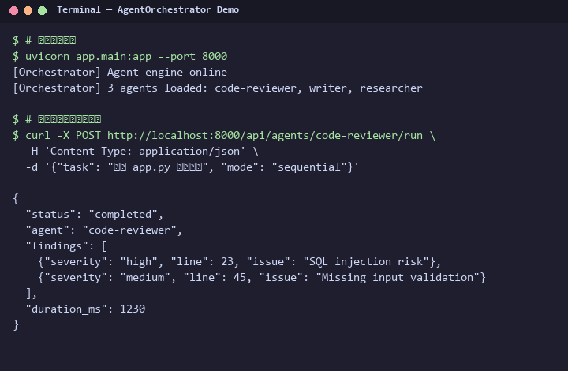

# AgentOrchestrator

**Cross-language AI Agent orchestration platform — Python FastAPI inference core + Java Spring Boot admin panel. Tool calling, multi-agent workflows, RAG memory, and a Vue 3 dashboard.**

[🌐 English](README.md) | [中文](README_zh.md)

[](https://github.com/JING04-PRODUCER/agent-orchestrator/actions/workflows/python-test.yml)
[](https://www.python.org/)
[](https://adoptium.net/)
[](https://spring.io/projects/spring-boot)
[](https://fastapi.tiangolo.com/)
[](LICENSE)
[]()


> 🤖 **AI Agent · LLM Orchestration · Function Calling · Multi-Agent Workflow**

## Why This Exists

LangChain/LangGraph 的学习曲线很陡，CrewAI 功能全但比较重。我想有一个能自己掌控、代码量不大的 Agent 框架。

| Need | LangGraph | CrewAI | AgentOrchestrator |
|------|-----------|--------|-------------------|
| Python LLM inference | Yes | Yes | Yes |
| Java admin panel | No | No | Yes |
| DAG workflow | Yes | Yes | Yes |
| Tool plugin registry | Yes | Yes | Yes |
| RAG memory | Yes | Yes | In-memory only |
| Self-hosted | Yes | Yes | Yes (Docker) |

模型无关——任何 OpenAI 兼容 API 都能用。Java 管理后台是因为我 Java 也写。

## Architecture

```
┌─────────────────────────────────────────────────┐
│           Admin Server (Spring Boot)             │
│  Agent CRUD · Task Scheduling · Monitoring       │
│                    port 9090                     │
└────────────────────────┬────────────────────────┘
                         │ REST API
┌────────────────────────▼────────────────────────┐
│          Agent Core (Python FastAPI)             │
│  LLM Agent · Tool Calling · Retry · Workflow     │
│                    port 8000                     │
└───────┬────────────┬────────────┬───────────────┘
        │            │            │
   ┌────▼───┐  ┌─────▼────┐ ┌───▼───────┐
   │ OpenAI │  │ Local    │ │ PostgreSQL│
   │Compat. │  │ Tools    │ │  + Redis  │
   └────────┘  └──────────┘ └───────────┘
```

## Demo



*Create agents → chain workflows → get results — all via REST API.*

## Quick Start

### Prerequisites

- Python 3.12+
- Java 21+
- Docker & Docker Compose (recommended)
- OpenAI-compatible API key

### Docker (recommended)

```bash
git clone https://github.com/JING04-PRODUCER/agent-orchestrator.git
cd agent-orchestrator
cp .env.example .env  # Edit and add your OPENAI_API_KEY
docker compose up -d

# Verify
curl http://localhost:8000/health       # Agent Core
curl http://localhost:9090/api/admin/health  # Admin Server
```

### Local Development

```bash
# Agent Core (Python)
cd agent-core
pip install -r requirements.txt
python main.py                 # http://localhost:8000

# Admin Server (Java)
cd admin-server
./mvnw spring-boot:run         # http://localhost:9090
```

## Core Features

### Create & Run an Agent

```bash
# Create
curl -X POST http://localhost:8000/api/agents \
  -H "Content-Type: application/json" \
  -d '{
    "name": "code-reviewer",
    "system_prompt": "You are a code review expert...",
    "tools": ["read_file", "execute_sql"],
    "max_iterations": 5
  }'

# Execute
curl -X POST http://localhost:8000/api/agents/code-reviewer/run \
  -H "Content-Type: application/json" \
  -d '{"task": "Review app.py for security issues"}'
```

### Multi-Agent Workflow

```bash
curl -X POST http://localhost:8000/api/workflows \
  -H "Content-Type: application/json" \
  -d '{
    "agents": ["analyzer", "reviewer", "tester"],
    "task": "Analyze code quality for this project",
    "mode": "sequential"
  }'
```

## Built-in Tools

| Tool | Description | Category |
|------|-------------|:--------:|
| `read_file` | Multi-encoding file reader (txt/json/csv/md) | file |
| `execute_sql` | Safe parameterized SQL queries (SELECT only) | database |
| `list_tables` | Database schema inspection | database |
| `web_search` | DuckDuckGo web search (free, no API key) | web |

> Extend via plugin registry — add your own tools in `tools/`.

## End-to-End Example

### 1. Create a Code Review Agent

```bash
curl -X POST http://localhost:8000/api/agents \
  -H "Content-Type: application/json" \
  -d '{
    "name": "code-reviewer",
    "model": "claude-sonnet-4-6",
    "system_prompt": "You are a senior code reviewer. Focus on security, performance, and best practices.",
    "tools": ["read_file", "web_search"],
    "max_iterations": 5
  }'
```

### 2. Submit a Review Task

```bash
curl -X POST http://localhost:8000/api/agents/code-reviewer/run \
  -H "Content-Type: application/json" \
  -d '{"task": "Review app.py for SQL injection and XSS vulnerabilities"}'
```

### 3. Check Results

```bash
curl http://localhost:8000/api/agents/code-reviewer/status
```

### 4. Multi-Agent Pipeline

```bash
curl -X POST http://localhost:8000/api/workflows \
  -H "Content-Type: application/json" \
  -d '{
    "agents": ["analyzer", "code-reviewer", "tester"],
    "task": "Full code quality audit for the auth module",
    "mode": "sequential"
  }'
```

### 5. View in Dashboard

Open `http://localhost:9090` to see agents, tasks, and workflow status in the Spring Boot admin panel.

## RAG Memory System

```bash
# Initialize memory
curl -X POST http://localhost:8000/api/memory/init

# Store context
curl -X POST http://localhost:8000/api/memory/remember \
  -H "Content-Type: application/json" \
  -d '{"content": "The authentication module uses JWT...", "metadata": {"topic": "auth"}}'

# Semantic recall
curl -X POST http://localhost:8000/api/memory/recall \
  -H "Content-Type: application/json" \
  -d '{"query": "How does login work?"}'
```

## Tech Stack

| Layer | Technology | Notes |
|-------|-----------|-------|
| AI Inference | Python FastAPI + OpenAI SDK | LLM calls, Function Calling |
| Tool System | Plugin registry + asyncio | Timeout control, auto-retry |
| Workflow | DAG orchestration + parallel scheduling | Multi-agent collaboration |
| Admin | Java 21 + Spring Boot 3.4 | REST API, JPA |
| Storage | PostgreSQL 16 + Redis 7 | State persistence, caching |
| Deployment | Docker Compose | One-command startup |

## 当前限制

需要先说明的几件事：

- **RAG 记忆是内存存储**，重启后数据丢失。生产环境需要接向量数据库，目前还没做
- **DAG 工作流上下文传递有限**：上游 Agent 的输出拼接到下游任务字符串里，没有结构化传递
- **无认证机制**：API 端点没有 auth，内网部署用，别暴露到公网
- **工具注册是代码级**：新工具需要在 `tools/` 下写 Python 文件并注册，MCP 协议支持在计划中
- **Java 管理后台数据聚合层还在补**——前端仪表盘（Vue 3 SPA）已可用

这些不是 bug，是当前状态。欢迎 PR。

## Roadmap

- [x] LLM Agent core (OpenAI compatible)
- [x] Tool registry & invocation
- [x] Multi-agent workflow engine (sequential + parallel)
- [x] Spring Boot admin backend
- [x] Web Search tool (DuckDuckGo)
- [x] RAG memory system (in-memory)
- [x] Vue 3 dashboard SPA
- [x] Streamlit admin console
- [ ] RAG persistence (vector DB integration)
- [ ] Code Executor tool (sandboxed)
- [ ] MCP protocol support
- [ ] API authentication
- [ ] Monitoring & alerts (Prometheus + Grafana)

## Contributing

Issues and PRs welcome! See [contribution guide](docs/PLAN2-CONTRIBUTION-GUIDE.md) for getting started.

## License

MIT — see [LICENSE](LICENSE)
