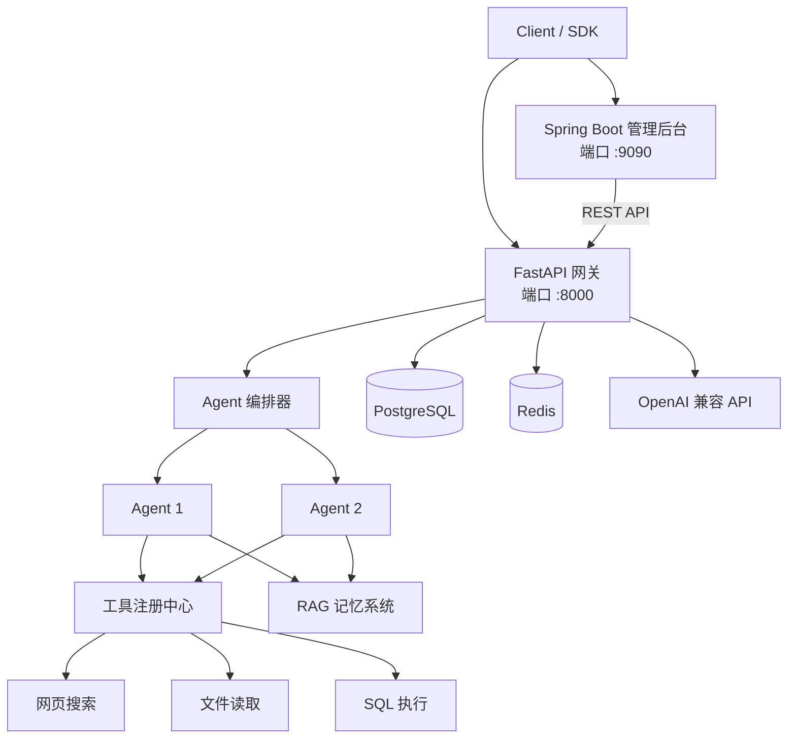

# AgentOrchestrator 🤖

**跨语言 AI Agent 调度平台 — Python FastAPI 推理核心 + Java Spring Boot 管理面板。分钟级构建带工具调用、多 Agent 工作流和可视化管理的 LLM Agent。**

[](https://www.python.org/)
[](https://adoptium.net/)
[](https://spring.io/projects/spring-boot)
[](https://fastapi.tiangolo.com/)
[](LICENSE)
[]()


> 🤖 **AI Agent · LLM 调度 · Function Calling · 多 Agent 工作流**

> [English](README.md)

## 为什么选择 AgentOrchestrator？

| 问题 | 现有方案 | 本项目 |
|------|----------|--------|
| Python 擅长 LLM 推理，但企业级管理弱 | FastAPI 缺乏内置管理后台 | FastAPI 推理 + Spring Boot 管理 |
| Java 生态成熟，但 LLM 整合碎片化 | Spring AI 仍在演进 | REST 桥接 Python LLM 能力 |
| Agent 框架锁定特定模型 | 多数绑定 OpenAI | OpenAI 兼容协议——任意模型 |
| 多 Agent 编排缺乏可见性 | 纯代码配置 | REST API + Web UI 路线图 |

## 架构



```
┌─────────────────────────────────────────────────┐
│           管理服务 (Spring Boot)                  │
│  Agent CRUD · 任务调度 · 监控                    │
│                    port 9090                     │
└────────────────────────┬────────────────────────┘
                         │ REST API
┌────────────────────────▼────────────────────────┐
│          Agent 核心 (Python FastAPI)             │
│  LLM Agent · 工具调用 · 重试 · 工作流             │
│                    port 8000                     │
└───────┬────────────┬────────────┬───────────────┘
        │            │            │
   ┌────▼───┐  ┌─────▼────┐ ┌───▼───────┐
   │ OpenAI │  │ 本地     │ │ PostgreSQL│
   │兼容接口│  │ 工具     │ │  + Redis  │
   └────────┘  └──────────┘ └───────────┘
```

## 快速开始

### 前置条件

- Python 3.12+
- Java 21+
- Docker & Docker Compose（推荐）
- OpenAI 兼容 API Key

### Docker（推荐）

```bash
git clone https://github.com/JING04-PRODUCER/agent-orchestrator.git
cd agent-orchestrator
cp .env.example .env  # 编辑并添加 OPENAI_API_KEY
docker compose up -d

# 验证
curl http://localhost:8000/health              # Agent 核心
curl http://localhost:9090/api/admin/health     # 管理服务
```

### 本地开发

```bash
# Agent 核心 (Python)
cd agent-core
pip install -r requirements.txt
python main.py                 # http://localhost:8000

# 管理服务 (Java)
cd admin-server
./mvnw spring-boot:run         # http://localhost:9090
```

## 核心功能

### 创建并运行 Agent

```bash
# 创建
curl -X POST http://localhost:8000/api/agents \
  -H "Content-Type: application/json" \
  -d '{
    "name": "code-reviewer",
    "system_prompt": "你是一位代码审查专家...",
    "tools": ["read_file", "execute_sql"],
    "max_iterations": 5
  }'

# 执行
curl -X POST http://localhost:8000/api/agents/code-reviewer/run \
  -H "Content-Type: application/json" \
  -d '{"task": "审查 app.py 的安全问题"}'
```

### 多 Agent 工作流

```bash
curl -X POST http://localhost:8000/api/workflows \
  -H "Content-Type: application/json" \
  -d '{
    "agents": ["analyzer", "reviewer", "tester"],
    "task": "分析此项目的代码质量",
    "mode": "sequential"
  }'
```

## 内置工具

| 工具 | 描述 | 分类 |
|------|------|:----:|
| `read_file` | 多编码文件读取 (txt/json/csv/md) | file |
| `execute_sql` | 安全参数化 SQL 查询（仅 SELECT） | database |
| `list_tables` | 数据库结构查看 | database |
| `web_search` | DuckDuckGo 网页搜索（免费，无需 API Key） | web |

> 通过插件注册中心扩展——分钟级添加自定义工具。

## 端到端示例

### 1. 创建代码审查 Agent

```bash
curl -X POST http://localhost:8000/api/agents \
  -H "Content-Type: application/json" \
  -d '{
    "name": "code-reviewer",
    "model": "claude-sonnet-4-6",
    "system_prompt": "你是一位资深代码审查专家，重点关注安全、性能与最佳实践。",
    "tools": ["read_file", "web_search"],
    "max_iterations": 5
  }'
```

### 2. 提交审查任务

```bash
curl -X POST http://localhost:8000/api/agents/code-reviewer/run \
  -H "Content-Type: application/json" \
  -d '{"task": "审查 app.py 中的 SQL 注入和 XSS 漏洞"}'
```

### 3. 查看结果

```bash
curl http://localhost:8000/api/agents/code-reviewer/status
```

### 4. 多 Agent 流水线

```bash
curl -X POST http://localhost:8000/api/workflows \
  -H "Content-Type: application/json" \
  -d '{
    "agents": ["analyzer", "code-reviewer", "tester"],
    "task": "对认证模块进行完整代码质量审计",
    "mode": "sequential"
  }'
```

### 5. 查看仪表盘

打开 `http://localhost:9090` 在 Spring Boot 管理面板中查看 Agent、任务和工作流状态。

## RAG 记忆系统

```bash
# 初始化记忆
curl -X POST http://localhost:8000/api/memory/init

# 存储上下文
curl -X POST http://localhost:8000/api/memory/remember \
  -H "Content-Type: application/json" \
  -d '{"content": "认证模块使用 JWT，密钥轮换周期为 7 天...", "metadata": {"topic": "auth"}}'

# 语义检索
curl -X POST http://localhost:8000/api/memory/recall \
  -H "Content-Type: application/json" \
  -d '{"query": "登录是怎么实现的？"}'
```

## 技术栈

| 层 | 技术 | 说明 |
|----|------|------|
| AI 推理 | Python FastAPI + OpenAI SDK | LLM 调用、Function Calling |
| 工具系统 | 插件注册 + asyncio | 超时控制、自动重试 |
| 工作流 | DAG 编排 + 并行调度 | 多 Agent 协同 |
| 管理后台 | Java 21 + Spring Boot 3.4 | REST API、JPA |
| 存储 | PostgreSQL 16 + Redis 7 | 状态持久化、缓存 |
| 部署 | Docker Compose | 一行启动 |

## 路线图

- [x] LLM Agent 核心（OpenAI 兼容）
- [x] 工具注册与调用
- [x] 多 Agent 工作流引擎
- [x] Spring Boot 管理后台
- [x] Web Search 工具（DuckDuckGo）
- [x] RAG 记忆系统
- [ ] Web UI 仪表盘 (Vue 3)
- [ ] Code Executor 工具
- [ ] MCP 协议支持
- [ ] 监控告警 (Prometheus + Grafana)

## 参与贡献

欢迎 Issue 和 PR！详见[贡献指南](docs/PLAN2-CONTRIBUTION-GUIDE.md)。

## 🤖 AI 辅助说明

本项目在开发过程中使用了 Claude (Anthropic) 作为编程辅助工具。AI 贡献包括代码结构建议、测试生成和文档撰写辅助。所有 AI 生成的代码均经过人工审查和验证，项目的设计决策和核心逻辑由开发者独立完成。

## 许可证

MIT — 详见 [LICENSE](LICENSE)
